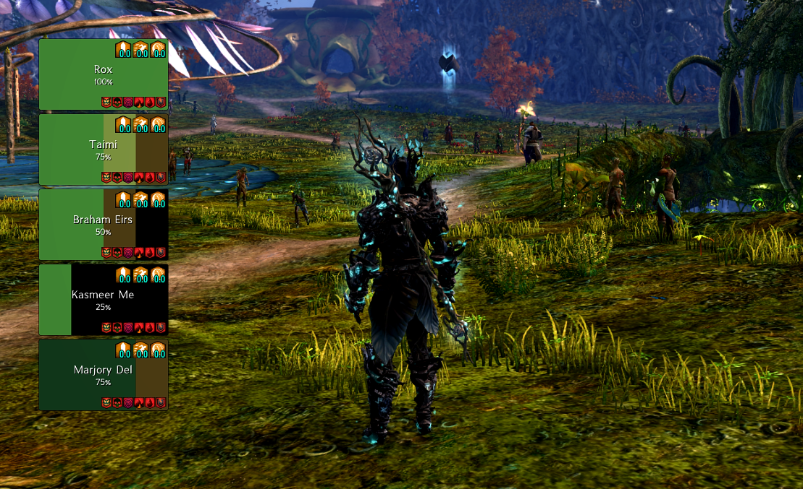

# Vital Signs

**Vital Signs** is a customisable party and squad frame addon for Guild Wars 2, inspired by [Cell](https://github.com/enderneko/Cell) and [Reffect](https://github.com/Zerthox/gw2-reffect). It allows players to monitor the health, effects and status of their group through user-defined layouts.

Please review our [Addon Policy](#addon-policy) to learn how we handle game data and operate within ArenaNet's guidelines.

## Features

### Flexible Layout Systems
Vital Signs supports multiple visualisation styles to suit different playstyles:
- **Grid Layouts:** Traditional layout where unit frames are arranged in rows and columns. 
- **Radial Layouts:** Circular layout where unit frames are arranged in slices around a central point.
- **Context Switching:** Automatically switch between different layouts based on your group type and setting:
    - **Party** (5 players)
    - **Raid** (10 players)
    - **Squad** (50 players)

### Deep Customisation
Design your interface directly in-game with a real-time layout editor.
- **Indicators:** Compose frames using a variety of visual elements:
    - **Icons:** Track boons, conditions, and other effects with custom icons.
    - **Text Labels:** Display names, health percentages, and custom labels with adjustable fonts and styles.
    - **Highlights & Borders:** Add visual emphasis to frames based on triggers.
    - **Resource Bars:** Visualise health, barrier, and shroud (Necromancer/Specter) resources.
- **Colour Palettes:** 
    - **Generic:** Matches the native Guild Wars 2 UI aesthetic.
    - **Profession:** Quickly identify teammates with health bars using profession-specific colours.
- **Live Preview:** Visualise your changes with dummy data as you edit.

### Dynamic Triggers
Every element in a layout is controlled by a trigger system:
- **Health States:** React to the health, barrier and status of players.
- **Effects:** Track a curated set of Boons, Conditions, Auras, and other effects. Triggers can be set for **active status**, **stack counts**, or **duration thresholds**.
- **Profession:** Create indicators based on a character's Profession or Elite Specialisation.

### Quick Actions
- **Click-to-Select:** Click a unit frame to target players in-game, allowing for quick support or inspection.

## Installation & Configuration

1. Ensure [Nexus](https://raidcore.gg/Nexus) is installed.
2. Download [`VitalSigns.dll`](https://github.com/jordanrye/nexus-vital-signs/releases/latest) and place it into your `<Guild Wars 2>/addons` directory.
3. Launch the game and open the Nexus addons window (default `Ctrl+O`) to configure Vital Signs:
    - **General:** Assign specific layouts based on group type and setting.
    - **Layout Editor:** Create, delete, and modify the visual components of your layouts.
    - **Presets:** Manage global colour palettes and text styles for a unified look.

## Addon Policy

Vital Signs utilises memory reading to access internal data from the Guild Wars 2 game client. To prevent potential abuse or the development of unauthorised cheats, the memory-access portion of the codebase remains closed-source and is restricted to a small group of verified developers.

This addon is designed to operate within the guidelines of the Guild Wars 2 [Third-Party Programs](https://help.guildwars2.com/hc/en-us/articles/360013625034-Policy-Third-Party-Programs) and [Macros & Macro Use](https://help.guildwars2.com/hc/en-us/articles/360013762153-Policy-Macros-and-Macro-Use) policies. In areas of ambiguity, development is guided by community consensus and available statements from ArenaNet staff.

### Compliance

To maintain game integrity and adhere to the policy outlined above, the following restrictions are enforced:

- **Data Parity:** Data is only made available if it is natively presented by the game client via the user interface, a graphical telegraph, or the combat log.
    - **Permitted:**
        - Health, barrier, and status information (e.g., Alive, Downed, Defeated, and Shroud).
        - Standard effects such as Boons, Conditions, and Auras.
            - Effect durations (available via the Effect Icon tooltip).
            - Effect stacks (available via the Effect Icon).
        - Profession and Elite Specialisation data.
    - **Permitted (without duration data):**
        - Control effects (e.g., Knockback animations).
        - Squad highlighting effects (e.g., Exile's Embrace pink border).
        - Mechanic telegraphs (e.g., Soul Shackles footfalls).
        - Mechanic circles (i.e., green, orange, and red AoE fields).
    - **Excluded:**
        - Raw numerical values for current and maximum health.
        - Shroud resource data (i.e., Life Force) while not actively in use.
- **Mode Restrictions:** Not available in competitive modes (PvP and WvW).

### Disclaimer

While every effort is made to ensure that Vital Signs complies with ArenaNet's current policies, the use of any third-party software is at the sole discretion of the player. The developers of this addon are not responsible for any actions taken against your account. ArenaNet's policies are subject to change without notice; we encourage you to stay informed and decide for yourself whether you are comfortable with the risks of using third-party programs.